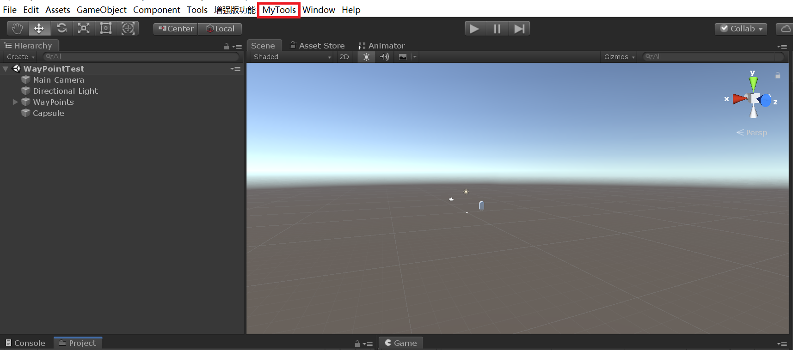
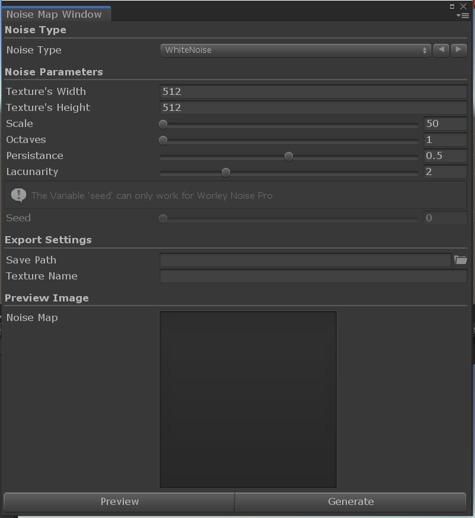
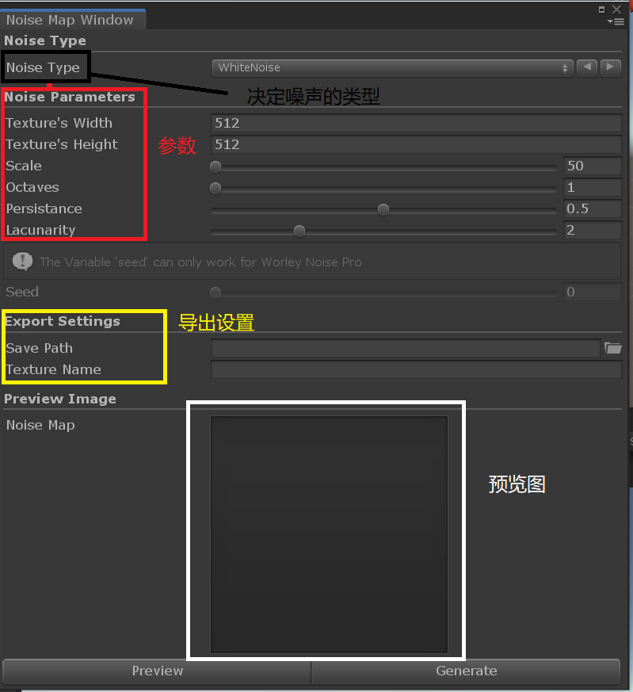
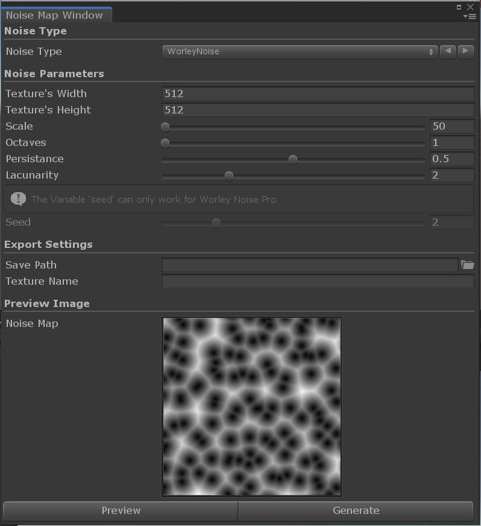

# NoiseTextureGenerator
 A Tool for generating various kinds of NoiseTexture.Of courese you can learn some noise algorithms by this repo
## Origin
 When I wrote Shader in Unity to accomplish some interesting effects,I found that 'NoiseMap' is frequently used.So I set about writing this code.
 Now I have finished this
## Get Start
 ### 1、Click the 'MyTools' button to open the tool window
 
 ### 2、The window is shown in the following figure
 
 ### 3、Set the parameters to generate different textures
 
 ### 4、After that,you can preview the result with clicking the 'Preview' button,When you find the one you like,you can click the 'Generate' button
 
